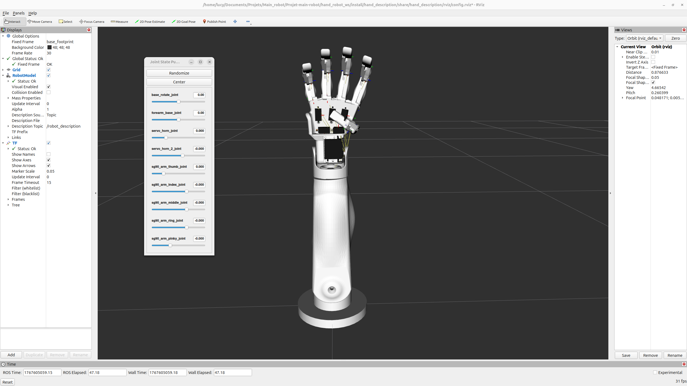
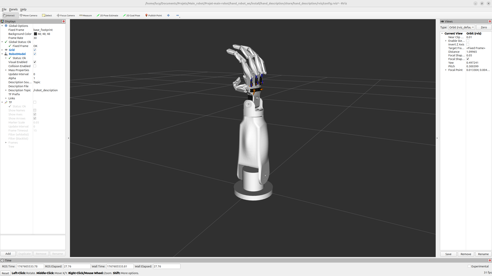
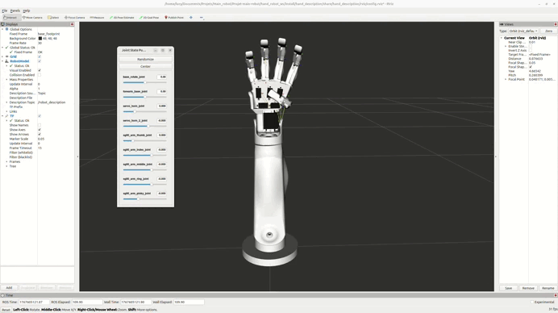

# Robotic Hand Prototype

Author: Lucy SAINT-AURET  
Start date: 29/04/2025  
Status: Work in progress

This public project documents the design and simulation of a robotic hand using ROS 2 (Jazzy), RViz and the Gazebo simulator. In the long term, the goal is to build a sign-language translator robot with two arms that can translate a provided sentence into sign language. The current, partial objective is to design a single hand and make it perform simple, well-controlled motions in simulation.


## Table of contents

- [Robotic Hand Prototype](#robotic-hand-prototype)
  - [Table of contents](#table-of-contents)
  - [Demo and visuals](#demo-and-visuals)
  - [Project goals](#project-goals)
  - [Repository structure](#repository-structure)
    - [`hand_description` package](#hand_description-package)
    - [`hand_moveit_config` package (WIP)](#hand_moveit_config-package-wip)
  - [What works today](#what-works-today)
  - [Work in progress](#work-in-progress)
  - [Known limitations and issues](#known-limitations-and-issues)
  - [Installation](#installation)
  - [How to run](#how-to-run)
    - [Visualize the hand in RViz](#visualize-the-hand-in-rviz)
    - [(Planned) MoveIt demo](#planned-moveit-demo)
  - [Future work](#future-work)

## Demo and visuals







## Project goals

- Design a 3D robotic hand (palm, fingers, forearm, wrist) from CAD and export meshes.
- Build a complete ROS 2 description package with URDF/Xacro, joints and sensors.
- Integrate ros2_control for actuating the hand in simulation.
- Visualize the robot in RViz and simulate it in Gazebo.
- Configure MoveIt for motion planning of the hand and validate simple motions (e.g. closing fingers, basic grasps).
- As a longer-term objective, extend the system from one hand to two arms capable of expressing full sentences in sign language.

## Repository structure

At the root of this repository, the ROS 2 workspace is in `hand_robot_ws`:

```text
hand_robot_ws/
  src/
    hand_description/      # URDF/Xacro, meshes and RViz configuration
    hand_moveit_config/    # MoveIt configuration (work in progress)
  build/                   # Build outputs (generated by colcon)
  install/                 # Install space (generated by colcon)
  log/                     # Colcon logs
```

### `hand_description` package

This package contains the robot model and visualization configuration:

- `meshes/`: STL meshes for the palm, fingers, wrist, forearm and servos.
- `urdf/`:
  - `hand.xacro`: main entry point for the full hand.
  - `palm.xacro`, `index.xacro`, `middle.xacro`, `forearm.xacro`, `wrist.xacro`: modular parts of the hand.
  - `ros2_control.xacro`: hardware interfaces and ros2_control configuration.
  - `common.xacro`: shared macros, constants and materials.
- `config/controllers.yaml`: controller configuration for ros2_control.
- `launch/demo.launch.py`: launches the hand in RViz.
- `rviz/*.rviz`: RViz configurations for quick visualization.

### `hand_moveit_config` package (WIP)

This package is being used to integrate the hand with MoveIt. It will provide:

- SRDF configuration for groups, end-effectors and planning.
- Planning pipelines and controllers configuration.
- RViz MoveIt configuration for interactive motion planning.

Currently this package is under active development (see the sections below for the current status and known issues).

## What works today

- The `hand_description` package builds on ROS 2 Jazzy.
- The URDF/Xacro model of the hand (palm, index and middle fingers, wrist and forearm) loads correctly.
- The meshes are correctly associated to the links, so the hand appears as a 3D model in RViz.
- Basic ros2_control configuration is in place and controllers can be loaded (depending on your local setup).

## Work in progress

The main area of work at the moment is MoveIt integration via the `hand_moveit_config` package:

- Setting up MoveIt planning groups and joints for the hand.
- Tuning collision geometry and allowed collisions.
- Validating simple planned motions (e.g. closing a finger, simple grasp motions).

The current blocker is collision handling: some links are still colliding incorrectly, which prevents valid motion plans from being generated. I am in the process of revisiting the collision geometry and the allowed collision matrix to fix this.

## Known limitations and issues

- MoveIt collision configuration is not finalized, which can make planning fail or produce no valid trajectories.
- Some controllers and joints may still need tuning, especially when running in Gazebo.
- There is currently no hardware driver: everything is focused on simulation and visualization.

## Installation

Prerequisites:

- ROS 2 Jazzy installed on your machine.
- RViz and Gazebo installed (usually provided with ROS 2 desktop installations).

Then:

```bash
git clone https://github.com/Lucy-saintauret/Projet-main-robot.git
cd Projet-main-robot/hand_robot_ws

source /opt/ros/jazzy/setup.bash
colcon build
source install/setup.bash
```

## How to run

### Visualize the hand in RViz

From `hand_robot_ws` after building and sourcing:

```bash
source install/setup.bash
ros2 launch hand_description demo.launch.py
```

This should start RViz with the hand model loaded. 

### (Planned) MoveIt demo

Once the `hand_moveit_config` package is stable, a dedicated launch file will be added here to start a MoveIt RViz session with the hand. The section will be updated with exact commands when it is ready.

## Future work

- Finalize collision geometry and allowed collision matrix for MoveIt.
- Add example MoveIt demo launch files for common motions.
- Improve Gazebo integration (sensors, contacts, more realistic dynamics).
- Move from simple, single-hand motions towards a set of basic sign-language gestures.
- Generalize the architecture to a full upper body (two arms and hands) to support sentence-level sign-language translation.
- Document hardware side (servos, electronics, wiring) if/when a physical prototype is built.


